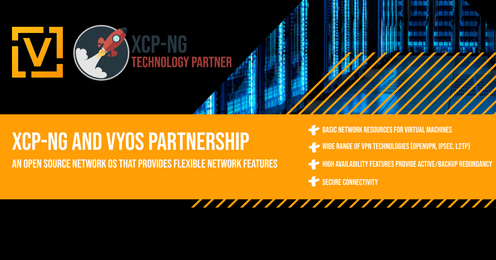
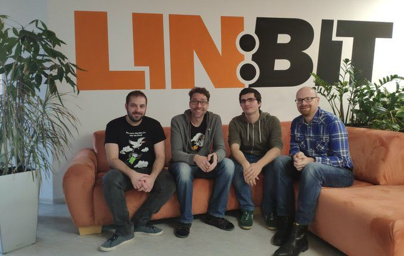
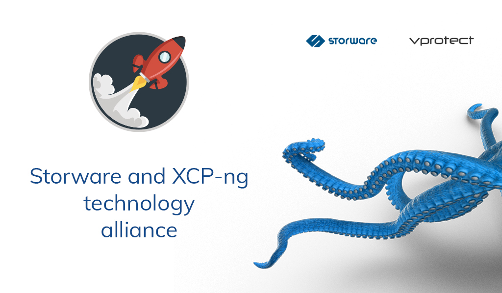
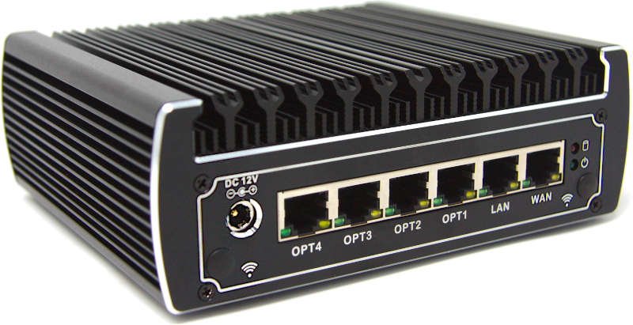
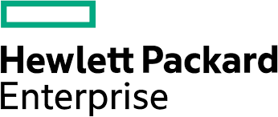
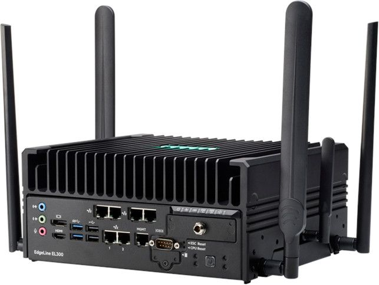

# XCP-ng Ecosystem

When we started developing XCP-ng as an alternative to Citrix XenServer, we were committed to creating a true and complete open source virtualization platform that companies can use in their production environment. This also means we were committed to creating a rich ecosystem to go along with it.

## Desktop virtualization

### UDS Enterprise

UDS Enterprise is a top performance multiplatform connection broker to deploy and administer Windows and Linux virtual desktops and applications. It automatically manages its full life cycle in a safe, quick and simple way. Here are some of the biggest advantages:

* VDI: Windows & Linux virtual desktop management and deployment
* Windows & Linux application virtualization
* Automatic resource lifecycle management
* Very easy installation, administration and usability
* Multiple hypervisors, authenticators and connection protocols running simultaneously
* Open Source core: platform customization
* Unlimited flexibility and scalability
* SSL secured WAN Access & split authentication system
* User access management to IT resources in Data Center or Cloud
*  Inverse costs scaling: the more users, the more the platform cost decreases

Learn more about UDS Enterprise [on their website](https://www.udsenterprise.com/en/).

We have carefully tested UDS deployment in an XCP-ng environment and UDS Enterprise is the first solution to join the XCP-ng ecosystem with an official Seal of Approval.

## Network

Everything related to network specialists in XCP-ng and Xen Orchestra ecosystem.

:::tip
If you want SDN capabilities for XCP-ng, take a look at [Xen Orchestra SDN controller](https://xen-orchestra.com/docs/sdn_controller.html) documentation!
:::

### VyOS

VyOS is an open source network OS that provides flexible network features such as traffic filtering, flow analysis, HA topologies, IPsec, OpenVPN, and NAT.Routing
Key points of using VyOS:

* Basic network resources for virtual machines (DNS, DHCP, NTP);
* Wide range of VPN technologies (OpenVPN, IPSec, L2TP);
* Secure connectivity: Built-in firewall to separate virtual machines, restrict access from outside, and protect workloads;
* High availability features provide active/backup redundancy for routers to avoid disruption of critical operations;
* No limits or requirements for license purchases.

VyOS is now fully compatible with XCP-ng and comes with paravirtual drivers dedicated included in the image for best performances.

:::tip
More to come soon on this side!
:::

## Storage

In order to build the best platform with multiple storage options, we are also working with companies being expert in storage solutions.

:::tip
We are integrating storage solution available directly from Xen Orchestra (XOSAN and XOSTOR). Don't forget to take a look at [XO website](https://xen-orchestra.com) to learn more!
:::

### LINBIT

LINBIT is a software clustering company specialized in data replication – including persistent block storage. The heart of LINBIT’s open-source technology is DRBD®. DRBD allows block storage between  servers to be replicated asynchronously or synchronously without sacrificing performance or reliability. LINBIT has led the way in High Availability since 2001 and developed the solution LINSTOR.

With this alliance, we are aiming to offer DRBD support inside the XCP-ng hypervisor and provide a way to access the solution developed by LI, including:

* LINBIT Software Define Storage (SDS)
* LINBIT High Availability
* LINBIT Disaster Recovery

Making XCP-ng compatible with LINBIT's solutions will allow us to provide new solutions for users that are looking  for performance and reliability with DRBD in their infrastructure.

There is still a lot of work to do in order to package DRBD in the XCP-ng kernel, make LINBIT's solutions compatible with XCP-ng, and finally provide an easy way to stay up-to-date.

We will work on all these goals in collaboration with LINBIT's teams this year and you will be informed through a series of blog posts regarding our progress.

The ecosystem around XCP-ng is getting bigger and bigger and we are really proud to associate our effort to provide the best Open Source virtualization platform with another leading Open Source project like LINBIT.

## VM backup

The main backup solution is Xen Orchestra, see the dedicated [backup](./backup.md) section. Alternatively, here is some 3rd party backup solutions that are officially compatible with XCP-ng.

### Storware Backup and Recovery

It's agentless but closed source. However, it supports a large variety of virtualization platforms, including [XCP-ng](https://storware.eu/storware-and-xcp-ng-technology-alliance/)!

* Website: [https://storware.eu/](https://storware.eu/solutions/virtual-machine-backup-and-recovery/xcp-ng-backup-and-recovery/)
* Documentation [is available here](https://storware.gitbook.io/backup-and-recovery)
* Agentless: yes
* Open Source: no

### VinChin backup

Another solution, which isn't agentless (you need to deploy some code in each host). XCP-ng is supported.

* Website: [https://www.vinchin.com/en/](https://www.vinchin.com/en/)
* Documentation: [available in PDF](https://www.vinchin.com/en/res/pdf/Vinchin_Product_Manual_2020.pdf)
* Agentless: no
* Open Source: no

## Edge Computing

Edge Computing is, in short, bringing compute power outside the datacenter. And the combo XCP-ng/Xen Orchestra is great for that! Take a look on our intro on "[What's Edge Computing](https://xcp-ng.org/blog/2020/07/31/edge-case-0/)".

Here is a list of hardware XCP-ng team tested and validated directly!

### Protectli

The **Protectli Vault** helps thousands of network professionals and self-professed geeks like us to keep our networks safe. It runs on advanced firmware. [Read more here](https://protectli.com).

#### Protectli Vault – 6 Port

XCP-ng is validated on this appliance: it just works out of the box. Completely fanless, idle at less than 10W, and enough firepower for almost all compute tasks.

### HPE Edgeline

HPE is selling a [complete range](https://buy.hpe.com/us/en/servers/edgeline-systems/edgeline-systems/edgeline-converged-edge-systems/hpe-edgeline-el4000-converged-edge-system/p/1008670180) of systems built directly for Edge Computing, called **EdgeLine**.

#### HPE EdgeLine EL300

We validated the **EL300** on XCP-ng, thanks to HPE letting us test the hardware.

You can read more on our tests inside the blog post [Edge Case #1 - HPE Edgeline server](https://xcp-ng.org/blog/2020/08/31/edge-case-1-xcp-ng/).

### More hardware partners to come!

Stay tuned :)

## Join the XCP-ng ecosystem

Do you have a solution or product and you want to join the XCP-ng ecosystem? [Contact us!](mailto:contact@xcp-ng.org)
