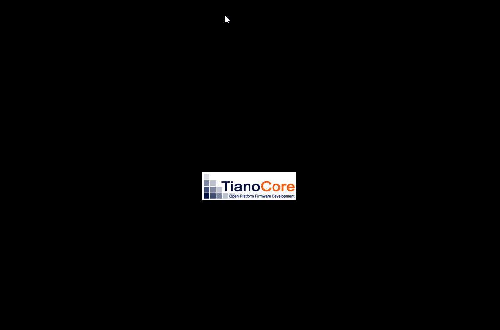
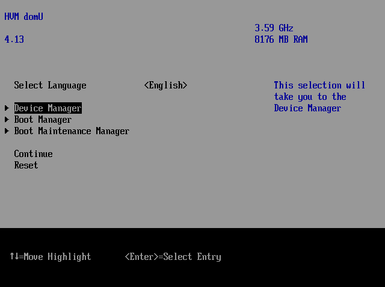
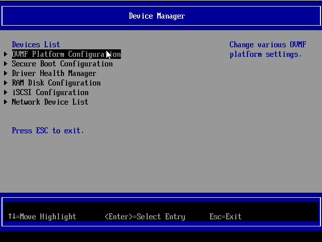
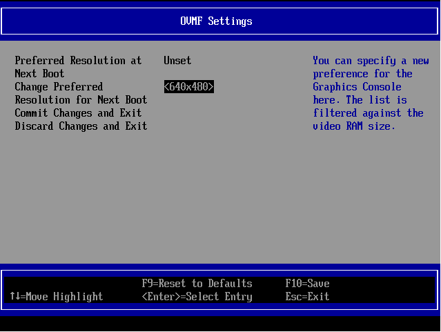

## VM
### All VMs
#### Dynamic Memory

Using Dynamic Memory Control (DMC) can be a good way to reduce your memory consumption, but you have to be careful: during live migration of a VM, XCP-ng will automatically reduce the VM memory to it's minimal settings and this can cause VM crash if it's not ready to function with this smaller amount of RAM.

We recommand you check your VM settings to verify if dynamic memory has been enabled.
In Xen Orchestra, the *Advanced* tab of your VM will display the memory limits, in the "VM limits" section:


If dynamic min is equal to dynamic max - as displayed in the screenshot - then dynamic memory is disabled.
If dynamic min < dynamic max, then make sure your VM is able to fully function with as little RAM as defined in *dynamic min*.

#### Use a VNC client

1. Connect to a XCP-ng server using SSH, then execute this command with the VM UUID to join:

```
xe vm-list params=dom-id,resident-on uuid=<VM_UUID>
```

For example:

```
xe vm-list params=dom-id,resident-on uuid=b2632c6a-8c0c-2fcc-4f1f-5b872733f58c
resident-on ( RO)    : 888254e8-da05-4f86-ad37-979b8d6bad04
         dom-id ( RO): 2
```

2. Then, check you are on the host where the VM is currently running using the host UUID:

```
xe pif-list management=true params=IP host-uuid=888254e8-da05-4f86-ad37-979b8d6bad04
IP ( RO)    : 172.16.210.15
```

If not, use this IP to create an SSH connection to the right host.

3. Ensure `socat` is installed and execute this command with the DOM ID got earlier and a free TCP port:

```
socat TCP-LISTEN:<TCP_PORT_TO_USE> UNIX-CONNECT:/var/run/xen/vnc-<DOM_ID>
```

What have we done? We exposed a UNIX domain socket (which allows us to connect to the VM using VNC) directly over TCP.

4. Fine, now open a new shell, and on your local machine create a SSH tunnel with a free TCP port:

```
ssh -L <LOCAL_PORT>:localhost:<REMOTE_PORT> root@<HOST_IP>
```

5. Finally, start the client, for example `vncviewer`:

```
vncviewer localhost:<LOCAL_PORT>
```

### Windows VMs
#### Manage screen resolution
##### Bios VM
For a Bios VM, screen resolution can be managed directly through the OS:
- Right click on the desktop
- Display settings
- Choose resolution

##### UEFI VM

For a UEFI VM, you will need to set up your resolution in the UEFI settings of the VM.
For that you first will need to enter the VM UEFI setup:
- At VM start, during Tiano firmware logo display, press ESC.
  

- You will enter the UEFI firmware management interface. Navigating with keyboard arrows, select *Device Manager* and press Enter.
  


- In  the next screen select *OVMF platform configuration*.
  


- In the OVMF settings, select *Change Preferred* then the resolution you want.


- Press F10 and save the changes.
- Restart your VM by sending a CTRL+ALT+DEL.
- After reboot your VM will display the selected resolution.

## Guest tools

XCP-ng needs guest tools to be installed in the VMs in order to communicate with the guest operating system. This brings better performance and is required for various features.

In short: *always install the guest tools to your VMs*.

The tools are made of two main components:
* kernel drivers for the OS
* a management agent

### Linux

Xen guest drivers have been built-in in the Linux kernel for many years. All currently supported Linux distributions include them.

So all we need is to install the management agent, which comes either as a systemd or as a sysvinit service, depending on the Linux distribution. The service is usually named `xe-linux-distribution`.

Those guest tools can be installed:
* from the target distribution's online repositories if available
* from the Guest Tools ISO image that can be attached to any VM in XCP-ng

#### Install from the distro's online repositories

Distros may provide guest tools for XCP-ng and Citrix Hypervisor in their own repositories. When they don't, or when the packages are outdated, we enjoin you to contact them to ask for new packages. Upstream sources are available at https://github.com/xenserver/xe-guest-utilities.

Distros often have policies that forbid enabling new services by default, so most of the time the steps are:
* enable the appropriate repository
* install the package from it
* enable the service

##### CentOS and Fedora
Enable the EPEL repository in the VM, then:
```
yum install xe-guest-utilities-latest
```
The service is not enabled by default, so enable it and start it:
```
systemctl enable xe-linux-distribution
systemctl start xe-linux-distribution
```

##### Alpine
Enable the `community` repository in `/etc/apk/repositories`, then:
```
apk add xe-guest-utilities
```
The service is not enabled by default, so enable it and start it:
```
rc-update add xe-guest-utilities
rc-service xe-guest-utilities start
```

##### Ubuntu

```
apt install xe-guest-utilities
```

Some older versions of Ubuntu, now EOL, may not have this package available in their repositories. Known such releases are 20.10 to 21.10. The best solution is to upgrade to a supported release. If this is really not possible, you may install the tools from the guest tools ISO.

*Feel free to add other distros to the above list if they provide the tools in their repositories.*

#### Install from the guest tools ISO

##### "Supported" Linux distributions
For distros that are supported by the `install.sh` script (Debian, CentOS, RHEL, SLES, Ubuntu...), the process is:
* Attach the guest tools ISO to the guest from Xen Orchestra or using `xe`.
* Then inside the VM, as root:
```
mount /dev/cdrom /mnt
bash /mnt/Linux/install.sh
umount /dev/cdrom
```
* No need to reboot the VM even if the script asks to. That's an old message from back when it was needed to install a kernel module in addition to the management agent. We'll get rid of it at some point.
* Eject the guest tools ISO

##### Derived Linux distributions
If your Linux distribution is not recognized by the installation script but derives from one that is supported by the script, you can override the detection and force the tools to install by using:
```
bash /mnt/Linux/install.sh -d $DISTRO -m $MAJOR_VERSION
```
Examples:
```
## derived from debian 10
bash /mnt/Linux/install.sh -d debian -m 10
## derived from RHEL or CentOS 8
bash /mnt/Linux/install.sh -d rhel -m 8
```

The likeliness for the installation to work correctly will depend on how much those distros differ from their "parent".

##### Other Linux distributions
For the remaining Linux distributions, mount the guest tools ISO as described above, then look for the `xe-guest-utilities_*_all.tgz` archive. Copy its contents on the system in `/etc` and `/usr`. It contains a System V init script by default but there's also a systemd unit file available on the ISO (`xe-linux-distribution.service`).

See also [Contributing](guests.html#contributing) below.

##### Specific cases

###### openSUSE Leap 15.2 with transactional-updates
For the xe-daemon to start it is necessary that insserv is installed on the system. To make sure that is the case run
```
sudo transactional-uptdates pkg install insserv-compat
```
and as good measure reboot if they weren't already installed.

To install the guest tools open up the chroot environment with
```
sudo transactional-updates shell
```
and mount the ISO like with every other derived distro
```
mount /dev/cdrom /mnt
bash /mnt/Linux/install.sh -d sles -m 15
umount /dev/cdrom
```
To exit the chroot cleanly you have to kill the `xe-daemon` process that may have been automatically started. Otherwise you end up with a corrupted snapshot and transactional-updates will fail.

And again reboot the system to go to your newest snapshot.

After the reboot enable the service and start it with
```
systemctl enable xe-linux-distribution.service
systemctl start xe-linux-distribution.service
```

#### Update the guest tools
It's a good habit, and may be even required in some cases (that would then be described in the [Release Notes](releases.md#all-releases), to update the guest tools to their latest version when your XCP-ng hosts are updated.

Depending on the situation, just update from your distribution's online repositories, or follow the above installation process again.

### FreeBSD

FreeBSD is a 30-year-old operating system used widely to run all sorts of systems and has served as the basis for a number of operating systems, including MacOS, pfSense, and FreeNAS. The Xen kernel modules are built and distributed in the GENERIC kernel, so if you haven't customised or recompiled your kernel, the drivers will be present.

To communicate with the hypervisor, you need to install two [ports](https://www.freebsd.org/ports/):
* [sysutils/xe-guest-utilities](https://www.freshports.org/sysutils/xe-guest-utilities/) 
* [sysutils/xen-guest-tools](https://www.freshports.org/sysutils/xen-guest-tools/) 

The `install.sh` script on the guest tools ISO does not yet support FreeBSD, so there is no point in mounting the guest tools ISO on a FreeBSD VM.

To manually [install xe-guest-utilities from a package](https://www.freebsd.org/doc/en_US.ISO8859-1/books/handbook/pkgng-intro.html) you can run:
```
pkg install xen-guest-tools xe-guest-utilities
service xenguest start
```

By default the `xe-daemon` will run if FreeBSD detects the Xen hypervisor at boot. If that autodetection fails for some reason, you can force it to try by putting `xenguest_enable=YES` in your `rc.conf` file: `sysrc xenguest_enable=YES`.

Run `service xenguest [stop|start|restart]` to respectively stop, start, or restart the `xe-daemon`.

### OpenBSD

On OpenBSD, the xen drivers are also already part of the kernel. The `install.sh` script doesn't support OpenBSD, but there are ways to install the management agent anyway.

:::tip
For OpenBSD search [the forum](https://xcp-ng.org/forum). See for example [this thread](https://xcp-ng.org/forum/topic/2582/guest-tools-for-openbsd).
:::

### FreeNAS/TrueNAS

FreeNAS is a locked-down version of FreeBSD, with many packages disabled to ensure a more stable environment for the fileserver. `xe-guest-utilities` is part of the packages that are **not** available in FreeNAS. But because it's based on FreeBSD, the packages from that OS can be installed, at your own risk. This is not a big issue for this particular package, because it's a _leaf_ in the chain of dependencies - nothing in FreeNAS depends on it.

To install it on versions 11 or higher, until version 12.0-U1 of TrueNAS that includes it as default, follow these steps.

1. Enable the FreeBSD repo first:
   ```bash
   # sed -i '' 's/enabled: no/enabled: yes/' /usr/local/etc/pkg/repos/FreeBSD.conf
   ```
   If you are using FreeNAS v11.2 or higher, you also have to disable the local package repository [to avoid an issue in that particular release and that may affect later versions](https://www.justinsilver.com/random/fix-pkg-on-freenas-11-2/) before running `pkg install`:
   ```bash
   # sed -i '' 's/enabled: yes/enabled: no/' /usr/local/etc/pkg/repos/local.conf
   ```
   
2. Create a temporary directory and move into it:
   ```bash
   # mkdir /tmp/repo
   # cd /tmp/repo
   ```
   
3. Fetch the required packages. A directory **All** will be created and you will find the packages with their current versions under there:
   ```bash   
   # pkg fetch -o /tmp/repo/ xen-guest-tools
   # pkg fetch -o /tmp/repo/ xe-guest-utilities
   ```
   
4. Add the downloaded packages, without their dependencies:   
   ```bash
   # pkg add -M All/xen-guest-tools-4.14.0.txz
   # pkg add -M All/xe-guest-utilities-6.2.0_3.txz
   ```
   The versions reported here are just the current version and they maybe different in your installation.
   
5. Revert the repos to their original settings to avoid surprises down the road. The second command should be run just if you disabled the local repo in step 1:
   ```bash
   # sed -i '' 's/enabled: yes/enabled: no/' /usr/local/etc/pkg/repos/FreeBSD.conf
   # sed -i '' 's/enabled: no/enabled: yes/' /usr/local/etc/pkg/repos/local.conf
   ```
   A restart of the VM will perform a reset of these files to their original settings too.
   
6. Once the package is installed, you need to tell FreeNAS to start the `xe-daemon` process when starting:
   1. Go to _Tasks -> Init/Shutdown Script_
   2. Create a new task with the following settings:
      * Type: _Command_
      * Command: `/usr/local/sbin/xe-daemon -p /var/run/xe-daemon.pid &`
      * When: _Pre Init_
      * Enabled: Checked

7. Reboot. If you do not plan to reboot the VM, you can start the daemon manually running the command `/usr/local/sbin/xe-daemon -p /var/run/xe-daemon.pid &`. After you'll see a FreeBSD icon in your VM list on Xen Orchestra, and you can restart/shutdown the VM properly from the Web UI.

More insights and options are available in [this issue](https://github.com/xcp-ng/xcp/issues/172#issuecomment-548181589) or [this issue](https://github.com/xcp-ng/xcp/issues/446).

### Windows

Windows guests need both the device drivers and the management agent.
* The **device drivers** bring optimized I/O performances.
* The **management agent** brings more manageability of the VM from XCP-ng, and guest metrics reporting to the host.

#### Citrix tools vs XCP-ng tools

There exists two different set of tools that you can use on your VMs: the official tools from Citrix Hypervisor, or the fully open-source tools from XCP-ng. Both work well. The important point is **not to mix them in the same VM**.

Citrix tools:
* :heavy_plus_sign: Benefit from all the testing by Citrix QA team.
* :heavy_plus_sign: The drivers can be updated through Windows Update.
* :heavy_minus_sign: Proprietary, closed-source.

XCP-ng tools:
* :heavy_plus_sign: Fully open-source.
* :heavy_plus_sign: Maintained by the XCP-ng project.
* :heavy_plus_sign: :heavy_minus_sign: The sources for the drivers are from the Xen project directly, without additional Citrix patches. This is good, but it may be that in some specific situations Citrix drivers behave better (None known at the moment).
* :heavy_minus_sign: The sources for the management agent are older than that of Citrix (they have stopped updating GitHub a while ago).
* :heavy_minus_sign: Maintained by one overloaded community member until Vates finds a developer to hire or contract with in order to maintain them more efficiently.
* :heavy_minus_sign: Won't transparently replace existing Citrix tools. You need to remove Citrix tools first if they are present, in order to install XCP-ng tools.

It's now up to you to choose.

#### XCP-ng Windows Guest Tools
Drivers built by the XCP-ng community.

**Download**: <https://github.com/xcp-ng/win-pv-drivers/releases>

Stability and testing status: [Windows guest tools community testing](https://github.com/xcp-ng/xcp/wiki/Windows-guest-tools-community-testing).

##### How to know if tools are already installed and working

The VM needs to be running for this test.

###### From Xen Orchestra
You can see this information in the General tab of the VM view.
* Device drivers: XO displays "Hardware virtualization with paravirtualization drivers enabled (PVHVM)" on the General tab
* Management agent: XO displays "Management agent detected" or "Management agent version {version} detected"

More detailed information can also be found in the Advanced tab.

###### From command line
* Device drivers: `xe vm-param-get param-name=PV-drivers-detected uuid={VM-UUID}`
* Management agent: `xe vm-param-get param-name=PV-drivers-version uuid={VM-UUID}` (ok if not empty)

##### Installing on fresh installed Windows

###### Prerequisite: Disable "Windows Update tools"
The first step, before the VM creation and first start, is to make sure than Windows Update is not going to install Citrix tools automatically at first boot. This behaviour is governed by the "Windows Update tools" parameter in a VMs advanced view. It must be off.

Before creating the VM:
* Make sure you are not creating it from a custom template than has the "Windows Update tools enabled.
* :warning: Do not create it from XCP-ng Center. XCP-ng Center automatically enables that option when the license allows it (and in XCP-ng the license always allows it...). This behaviour may be modified in the future.

Before starting the VM:
* Check the value of "Windows Update tools" in the Advanced tab of your VM in Xen Orchestra. Must be off.

If you already started the VM with the option on, then the Citrix drivers have been installed automatically. Restart from scratch or see below how to remove them.

Tip: you can also check the value of the parameter from the command line.
```
xe vm-param-get param-name=has-vendor-device uuid={VM-UUID}
```
`True` means that it's active, `False` that it isn't. It needs to be `False`.

###### Install the XCP-ng drivers
0. snapshot before just in case
1. unpack the ZIP file
2. start setup.exe
3. follow the install wizard

**Note**: Restart can take a while if your windows is currently updating. Restart only occurs after windows has the updates finished.

4. after restart one of two messages should pop up
    * request for restart <- just restart!
    * Management Agent installed successfully <- enjoy :-)

##### Upgrade from Citrix :registered: XenServer :registered: client tools

Our installer is not able currently to cleanly uninstall Citrix tools. Citrix tools' uninstaller itself isn't either: it leaves various things behind.

So we need to perform a complete manual clean-up of the tools:
* either entirely manually
* or using the experimental PowerShell script contributed by one of our users at <https://github.com/siodor/win-tools-cleanup>

:warning: In any case, first disable "Windows Update tools" for the VM (Xen Orchestra, advanced tab) and reboot it.

Following is the manual process.

###### The confident option

You can try a simple process first with some chances of success.

0. Make a snapshot so you can rollback. Windows can get unstable/unbootable if things go wrong.
1. Uninstall Citrix :registered: XenServer :registered: Client Tools
2. Reboot
3. Uninstall `XenServer PV`-Drivers in Device Manager in following order (reboots may be needed):
    * `XenServer PV Network Device` (one ore more Devices)
    * `XenServer PV Storage Host Adapter`
    * `XenServer PV Network Class`
    * `XenServer Interface`
    * `XenServer PV Bus (c000)` (if present)
    * `XenServer PV Bus (0002)` or `XenServer PV Bus (0001)`
4. Reboot
5. Check that you see this unknown device in Device Manager:
    * `SCSI-Controller` - PCI-Device ID `5853:0002`
6. Unpack ZIP file
7. Start setup.exe
8. Follow the install wizard

**Note**: Restart can take a while if your windows is currently updating. Restart only occurs after windows has the updates finished.

###### The nuclear option

If the *confident option* above didn't yield the expected results, then we switch to a more aggressive attitude towards the old tools.

:::tip
What follows works in many cases, but some users occasionally still meet the following issues: XCP-ng tools not installing (but Citrix tools install well, so that is a solution to have working tools), and occasional BSODs in some cases or versions of Windows.

Through many tests, a user came up with a similar yet slightly different procedure that allowed them to avoid Blue Screens Of Death in their situation: https://xcp-ng.org/forum/post/27602.

Help is welcome to help us reconcile both procedures into one.
:::

* Follow the steps 0 to 4 of the "confident option" above if not done yet.
* Follow this (ignore steps 6 and 7, do not try to install the tools yet) <https://support.citrix.com/article/CTX215427>
* Now open regedit and go to HKLM\SYSTEM\CurrentControlSet\Services and delete entries for all xen* services.
* In regedit, also go to HKLM\SOFTWARE\Microsoft\Windows\CurrentVersion\DIFx\DriverStore and remove ONLY xennet* xenvif*
* Go to C:\Windows\System32 and remove: (you may not have all these)
  * xenbus_coinst*.dll
  * xenvbd_coinst*.dll
  * liteagent.exe
* Now go to C:\Windows\System32\drivers and remove any files named xen*
* Go to C:\Windows\system32\DriverStore\FileRepository and remove xennet* and Xenvif* directories.
* Open the Device Manager and Click View --> Show Hidden Devices. Select Other Devices and Right click on XENBUS VIF and select uninstall. If it asks to delete the driver, check yes. Do this for any xen related thing you see in device manager. Also do the same for any unknown devices.
* Lastly, reboot the VM. You should now hopefully be able to install xen tools regularly.

**Note**: Also have a look at our [Troubleshooting Guide - Windows PV-Tools](troubleshooting.html#windows-agent-pv-tools).

##### VMs with INACCESSIBLE_BOOT_DEVICE error

You can try to manually inject the missing drivers in recovery mode.

* Get the "Drivers" folder from the XCP Tools installation path (C:\PROGRAM FILES...) - from another VM or install the tools somewhere else to get it.
* Create an ISO-Image containing the "Drivers" folder (see <http://imgburn.com>) and mount that ISO-Image to your VM
* Boot to recovery mode and use the command line and the tool "dism" (see [Microsoft Docs](https://docs.microsoft.com/en-us/windows-hardware/manufacture/desktop/add-and-remove-drivers-to-an-offline-windows-image)) to inject the drivers (specifically the xenbus and xenvbd drivers) - watch out for the drive letter of the Windows installation and the CD-Drive ('D' and 'E' in the following example):

````
dism /image:d:\ /add-driver /driver:e:\Drivers\xenbus\x64\xenbus.inf
dism /image:d:\ /add-driver /driver:e:\Drivers\xenvbd\x64\xenvbd.inf
````

#### Using the Windows guest tools from Citrix

Tools from Citrix are not included in the guest tools ISO distributed with XCP-ng for legal reasons.

##### A reminder
As written above:

> * The **device drivers** bring optimized I/O performances.
> * The **management agent** brings more manageability of the VM from XCP-ng, and guest metrics reporting to the host.

##### Management agent + device drivers
The only way to get the management agent is from Citrix. It can be freely downloaded from [the Citrix Hypervisor download page](https://www.citrix.com/downloads/citrix-hypervisor/), provided you create an account on their site. Name of the item: "Citrix VM Tools for Windows". The installer will install both the management agent and the device drivers.

:::tip Update (2022-02-02)
Since Citrix released their 8.2 CU1 version of Citrix Hypervisor, the Express edition is not available anymore for download. However, you can still get the Windows tools from the previous releases that are still available under "Citrix Hypervisor and XenServer Legacy Versions". You will also find present and past releases of the tools at: <https://support.citrix.com/article/CTX235403>.
:::

##### Automated installation via Windows Update: device drivers alone
If you are using Xen Orchestra, you can switch the "Windows Update tools" advanced parameter on from the "Advanced" tab of the VM view. This will install the device drivers automatically at next reboot :warning: **but not the management agent** which still needs to be installed from Citrix tools' installer.

... So the "Windows Update tools" option is not a complete solution if you need the guest metrics from the management agent. However it may be a convenient way to get future driver updates if you wish so.

##### Switching from XCP-ng tools to Citrix tools
If your VM already has XCP-ng tools and you wish to switch to Citrix tools, then you need to do the same kind of clean-up as described higher in this document for the opposite situation.

#### Contributing
##### Linux / xBSD
If you would like to contribute improvements to the `install.sh` script so that it supports your distro, create a pull request against: https://github.com/xcp-ng/xe-guest-utilities/tree/master/mk. Relevant files are usually `xe-linux-distribution` and `install.sh`.

##### Windows
The XCP-ng team is looking for help in improving the guest tools installer, build process, and clean-up tools.
