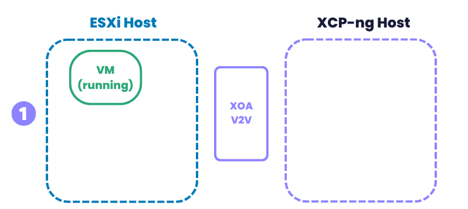
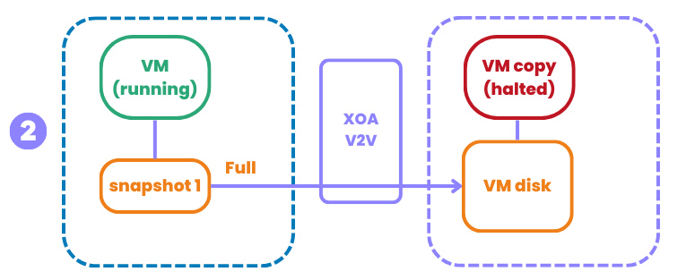
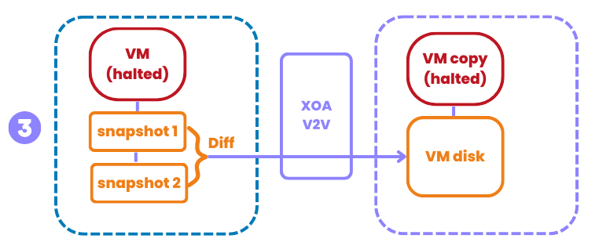
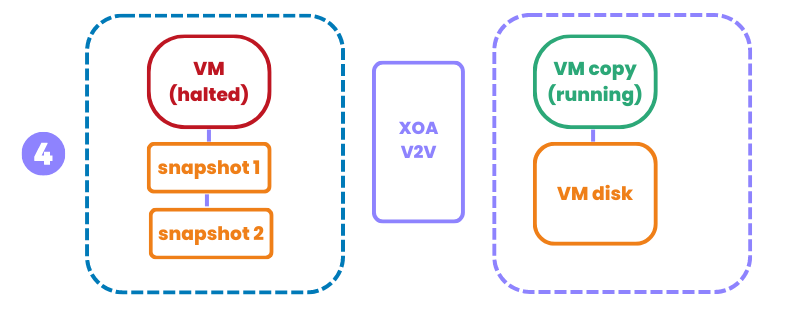

# Migrate to XCP-ng

How to migrate from VMware, KVM, etc. to XCP-ng.

This documentation will help you to make a migration to XCP-ng, from any most common other virtualization platform (VMware, KVM, etc.)

:::note
OVA import method will miss the information if the VM is running BIOS or UEFI mode. Double check your settings on your original system, and then enable (or not) UEFI on XCP-ng side for the destination VM. You can do so in VM advanced tab in Xen Orchestra.
:::

## 🇽 From XenServer

We got a dedicated section on [how to migrate from XenServer to XCP-ng](../../installation/upgrade#upgrade-from-xenserver).

## 🍋 From Citrix Hypervisor

We got a dedicated section on [how to migrate from Citrix Hypervisor to XCP-ng](../../installation/upgrade#upgrade-from-xenserver).

## 🐼 From Xen on Linux

If you are running Xen on your usual distro (Debian, Ubuntu…), you are using `xl` to manage your VMs, and also plain text configuration files. You can migrate to an existing XCP-ng host thanks to [this Python script](https://gist.github.com/olivierlambert/0182f1cee63568edffd3b71b497b2eff).

1. Get that script in your current `dom0`.
1. Shutdown your VM
1. Run the script, VM by VM with for example: `./xva.py -c /etc/xen/vm1.cfg -n vm1 -s xcp_host_1 --username=root --password="mypassword" --no-ssl`. You can use a hostname or the IP address of your XCP-ng host (name `xcp_host_1` here)
1. Your disks are streamed while the configuration file is "translated" to a VM object in your XCP-ng host.
1. As soon it's done, you should be able to boot your VM on destination
1. Repeat for all your VMs

If you have an error telling you that you don't have an default SR, please choose a default SR on your XCP-ng pool (in XO, Home/Storage, hover on the storage you want to put by default, there's an icon for it).

:::info
This script is a bit old and not tested since while. If you have issues, feel free to report that!
:::

## 📦 From Virtualbox

Export your VM in OVA format, and use Xen Orchestra to import it. If you have an issue on VM boot, check the [VMware](#fromvmware) section.

## 🇻 From VMware

### XO V2V

Xen Orchestra introduces "V2V," or "VMware to Vates", a streamlined tool for migrating from VMware to the Vates Stack, encompassing XCP-ng and Xen Orchestra (XO). Seamlessly integrated into Xen Orchestra, this tool utilizes the "warm migration" feature for efficient transitions. The process initiates with exporting an initial snapshot of the VMware-based VM, which, despite being time-consuming, occurs without disrupting the VM's operation, ensuring transparency.

Once this comprehensive replication completes, the VM is shut down, and only the newly modified data blocks since the snapshot are exported. The VM is then activated on the XCP-ng platform, significantly minimizing downtime, a crucial benefit for large VMs. Furthermore, the migration process is largely automated, allowing for hands-off monitoring and execution. This entire procedure is fully automated for user convenience and efficiency.

You can read more in our [official VMware to XCP-ng migration guide](https://xcp-ng.org/blog/2022/10/19/migrate-from-vmware-to-xcp-ng/).

#### How it works

The initial situation: a running VM on ESXi on the left, your Xen Orchestra in the middle, and your Vates XCP-ng host on the right:



The initial sync: the empty VM is created on XCP-ng, and after a snapshot, the content is transferred from VMware side to the new VM disk on XCP-ng. This takes time, but your original VM is up all along (no service interruption):



After the initial sync, the original VM is shutdown, another snapshot is done and only the diff is sent to the VM on XCP-ng side. Since it's a small amount of data, the downtime will be minimal:



After the transfer, the VM on XCP-ng side is started:




#### From the XO UI

In your Xen Orchestra UI, go into the main menu in the left, on the "Import" then "From VMware" option:


After giving the vCenter credentials, you can click on "Connect" and go to the next step:


On this screen, you will basically select which VM to replicate, and to which pool, storage and network. When it's done, just click on "Import" and there you go!

### OVA

Using OVA export from VMware and then OVA import into Xen Orchestra is another possibility.

:::tip
To skip Windows activation if the system was already activated, collect info about the network cards used in the Windows VM (ipconfig /all) and use the same MAC address(es) when creating interfaces in XCP-ng.
:::

Importing a VMware Linux VM, you may encounter an error similar to this on boot:

`dracut-initqueue[227]: Warning: /dev/mapper/ol-root does not exist`

The fix for this is installing some xen drivers *before* exporting the VM from VMware:

`dracut --add-drivers "xen-blkfront xen-netfront" --force`

[See here](https://unix.stackexchange.com/questions/278385/boot-problem-in-linux/496037#496037) for more details. Once the imported VM is properly booted, remove any VMware related tooling and be sure to install [Xen guest tools](../../vms).

### Inline import

Another possibility is to mount a VMware storage into XCP-ng and use `qemu-img` to convert the VMDK files to VHDs directly in your XCP-ng Storage Repository (SR).

:::warning
This method use external packages to install in XCP-ng directly (the Dom0), and you should remove them just after you did the migration. Those commands must be executed on the Dom0 itself.
:::

#### Install Qemu-img and vmfs tools

```
yum install qemu-img --enablerepo=base,updates
wget https://forensics.cert.org/centos/cert/7/x86_64/vmfs6-tools-0.2.1-1.el7.x86_64.rpm
yum localinstall vmfs6-tools-0.2.1-1.el7.x86_64.rpm
```

#### Mount the VMware storage repository

```
vmfs6-fuse /path/to/vmware/disk /mnt
```

#### Convert a VMDK file to a VHD

For example, on a file-based SR (local ext or NFS):

```
qemu-img convert -f vmdk -O vpc myVMwaredisk.vmdk /run/sr-mount/<SR UUID>/`uuidgen`.vhd
```

#### Rescan the SR

You need to rescan the SR where you new VHD file is, so it can be detected. It will appear in the disk list, without a name or description though. Attach it to the VM of your choice, and boot.

## 🇭 From Hyper-V

There's two options, both requiring to export your Hyper-V VM disk in VHD format.

:::warning
When exporting in VHD, always use a **dynamic disk** VHD format and not **static**, which doesn't work in XCP-ng.
:::

In any case, you **must remove all the Hyper-V tools** before exporting the disks.

### Import the VHD in Xen Orchestra

In the left menu, go for "Import" then "Disk". Select the destination SR, and then add your VHD file into it. Depending on the VHD file size, it might take some time. The upload progress can be tracked in another XO tab, in the "Task" menu.

When the disk is imported, you can:

4. Create a VM with the appropriate template, **without any disk in it**
5. Attach the previously imported disk (VM/Disk/Attach an existing disk)
6. Boot the VM
7. Install the tools

### Alternative: direct VHD copy

:::warning
This method is a bit more dangerous: if you don't respect the VHD name format, the SR will be blocked and giving warnings. Naming is crucial to avoid problems.
:::

It's possible to directly send the VHDs to an existing XCP-ng SR. However, you MUST respect some pre-requisites:
* to use a dynamic disk VHD format
* the VHD **MUST be named correctly** (see below)

#### VHD naming

The **ONLY** working format is `<UUID>.vhd`, eg `e4e573d8-6272-43ae-b969-255717e518aa.vhd`. You can generate a UUID by simply using the command `uuidgen`.

#### Steps

1. Rename the dynamic VHD disk to the format `<UUID>.vhd`
2. Copy it to the destination SR (any file type is supported: local, NFS…)
3. Scan the SR

:::note
As soon you did scan the SR, the new disk is visible in the SR/disk view. Don't forget to add a name and a description to be able to identify it in the future. Indeed, any disk imported this way won't have any metadata, so it's up to you to fill it.
:::

4. Create a VM with the appropriate template, **without any disk in it**
5. Attach the previously imported disk (VM/Disk/Attach an existing disk)
6. Boot the VM
7. Install the tools

:::note
If you lost ability to extend migrated volume (opening journal failed: -2) You need to move disk to another storage, VM should be ON during moving process. This issue can occur when vhd files was directly copied to storage folder.
:::

## 🇰 From KVM (Libvirt)

Related forum thread: [https://xcp-ng.org/forum/topic/1465/migrating-from-kvm-to-xcp-ng](https://xcp-ng.org/forum/topic/1465/migrating-from-kvm-to-xcp-ng)

_Due the fact I have only server here, I have setup a "buffer" machine on my desktop to backup and convert the VM image file._

* Install the dracut packages : yum install dracut-config-generic dracut-network

  `dracut --add-drivers xen-blkfront -f /boot/initramfs-$(uname -r).img $(uname -r)`

  If your VMs are in BIOS mode :

  `dracut --regenerate-all -f && grub2-mkconfig -o /boot/grub2/grub.cfg`

  If your VMs are in UEFI mode (OVMF Tianocore) :

  `dracut --regenerate-all -f && grub2-mkconfig -o /boot/efi/EFI/<your distribution>/grub.cfg`

* Shutdown the VM

* Use rsync to copy VM files to the "buffer" machine using `--sparse` flag.

* Convert the QCOW2 to VHD using QEMU-IMG :

  `qemu-img convert -O vpc myvm.qcow2 myvm.vhd`

* Use rsync to copy the converted files (VHD) to your XCP-ng host.

* After the rsync operation, the VHD are not valid for the XAPI, so repair them :

   `vhd-util repair -n myvm.vhd`

    `vhd-util check -n myvm.vhd` should return `myvm.vhd is valid`

* For each VM, create a VDI on Xen Orchestra with the virtual size of your VHD + 1GB (i.e the virtual size of myvm is 21GB, so I create a VDI with a size of 22GB).

* Get the UUID of the VDI (on Xen Orchestra or CLI) and use the CLI on the XCP-ng host to import the VHD content into the VDI :

  `xe vdi-import filename=myvm.vhd format=vhd --progress uuid=<VDI UUID>`

* Once the import is done, create a virtual machine using XO or XCP-ng Center, delete the VM disk that has been created and attach your newly created VDI to the VM. Don't forget to set the VM boot mode to UEFI if your VMs was in UEFI mode.

* Boot the VM and find a way to enter in the virtual UEFI of the VM. Here, I type the Escape and F9,F10,F11,F12 keys like crazy. Select Boot Manager, you should see this window :


* Select `UEFI QEMU HARDDISK`, the screen should be black for seconds and you should see the GRUB. Let the machine worked for minutes and you should see the prompt finally 👍

* Install Guest Tools and reboot. The reboot shouldn't take long, you don't have to redo step 13, the OS seems to have repair the boot sequence by itself.

Done !
