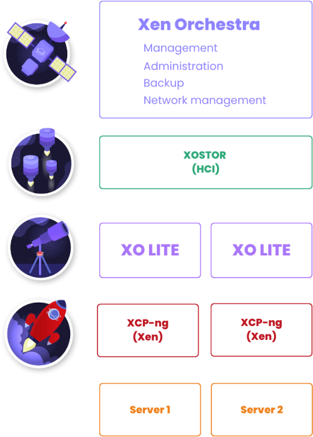

# Introduction

XCP-ng is a high performance enterprise level virtualization platform with a rich ecosystem, that can be integrated in an entire stack to do management and backup for it (see [Xen Orchestra](management/manage-at-scale/xo-web-ui) section for that). XCP-ng stands for *Xen Cloud Platform - next generation*: it is the modern successor to XCP, initially created as an Open Source version of Citrix XenServer back in 2010.

XCP-ng is -by default- a [secure platform](project/security) to run any kind of virtualization workload, while being managed by a [central administration console](management/manage-at-scale/xo-web-ui), integrated with an API and CLI but also compatible with Packer, Terraform and Ansible.

Visit the [main website](https://xcp-ng.org) to learn more. Latest updates are published on [our blog](https://xcp-ng.org/blog), don't miss any announcement there!

## ⚙️ General design

XCP-ng contains multiple components, built around the Xen Hypervisor. It's meant to run on top of bare-metal machines.

## 📚 Stack overview

The main goal of XCP-ng is to be a fully integrated and dedicated virtualization platform, without requiring any deep Linux or system knowledge. It's meant to be managed in a centralized manner via [Xen Orchestra](management/#xen-orchestra), regardless the fact you have only one host or thousand of them. Backup is also included inside Xen Orchestra.

## 🎓 Concepts

There's few concepts to grasp in order to get a clear picture about what is XCP-ng.

### Turnkey appliance

XCP-ng is distrubuted as an ISO file you can [download here](installation/install-xcp-ng#download-and-create-media) and [install](installation/install-xcp-ng) on the hardware of your choice (see our [hardware support](installation/hardware) section for more details). It's meant to be an appliance, already pre-configured to run any kind of virtual machine you need without any preparation.

### Compared to VMware

In terms of general architecture, XCP-ng and Xen Orchestra are relatively close. See for yourself:

### Managing XCP-ng

Now you have your hosts running, the next step is to manage it. You have various options to do so, choose the one that fits best! See the dedicated [management section](management).

#### Host API architecture

All XCP-ng clients are communicating with the pool master, through the Xen API ([XAPI](management/manage-locally/api.md)). You only need to open a connection to the master, even if there's multiple hosts.

Some clients are stateless (only running when you open or use them) and others are stateful (running in a daemon, often in a dedicated VM). For very basic management tasks, stateless clients are fine. However, for more advanced features, you need stateful clients. The default choice is to use Xen Orchestra, but a list of solution is available in our [management section](management).

### Backup

Xen Orchestra is a complete and agentless backup solution for your VMs running on XCP-ng. Please read the dedicated [backup section](management/backup) to get more details.

## 📹 Community videos on XCP-ng

:::note
Those videos are made by 3rd parties. However, for example, Tom from Lawrence Systems is providing a lot of content on XCP-ng and Xen Orchestra. Check his [YouTube channel](https://www.youtube.com/channel/UCHkYOD-3fZbuGhwsADBd9ZQ).
:::

Tom's video explaining what is XCP-ng:

<iframe width="560" height="315" src="https://www.youtube.com/embed/CEUFHudLO1g?si=EEM0Xi3inNpsYDeK" title="YouTube video player" frameborder="0" allow="accelerometer; autoplay; clipboard-write; encrypted-media; gyroscope; picture-in-picture; web-share" allowfullscreen></iframe>

A quick intro by Raid Owl:

<iframe width="560" height="315" src="https://www.youtube.com/embed/kguTbVBqmuw?si=bWze86s07ZDkLzlU" title="YouTube video player" frameborder="0" allow="accelerometer; autoplay; clipboard-write; encrypted-media; gyroscope; picture-in-picture; web-share" allowfullscreen></iframe>

### The Project

About the project itself, please see the [project page](/category/project).

### Follow us

* Our YouTube channel: https://www.youtube.com/@Vates_tech
* Latest XCP-ng news: https://xcp-ng.org/blog
* XCP-ng community: https://xcp-ng.org/forum
