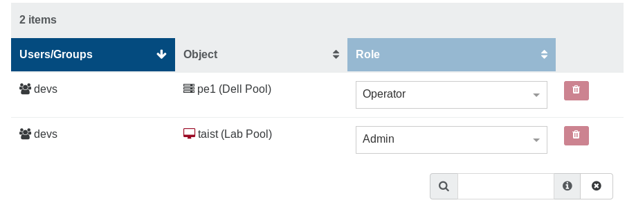
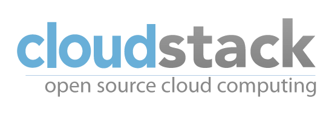

# Cloud features

Cloud features refer to the capability of delegating resources outside the platform administrators perimeters, like developers or customers.

You have multiple choices:

1. Using Xen Orchestra Cloud features (ACLs, Self Service)
2. Using CloudStack or OpenStack (adapted to very large deployments)

## Xen Orchestra

Some interesting "cloud-like" features are available in Xen Orchestra : ACLs and Self-service.

### ACLs

ACLs can be used to allow some XO users to only see some resources. See more about ACLs [on the official documentation](https://xen-orchestra.com/docs/acls.html).

### Self-service

The self-service feature allows users to create new VMs within a **limited amount of resources** (quotas). This is different from delegating existing resources (VMs) to them, and it leads to a lot of possibilities. [Read XO official doc on it](https://xen-orchestra.com/docs/users.html#self-service-portal) to know more.

## CloudStack

Apache CloudStack is open source software designed to deploy and manage large networks of virtual machines, as a highly available, highly scalable Infrastructure as a Service (IaaS) cloud computing platform. CloudStack is used by a number of service providers to offer public cloud services, and by many companies to provide an on-premises (private) cloud offering, or as part of a hybrid cloud solution.

**XCP-ng is a certified and compatible platform for CloudStack.**

See the [dedicated documentation](https://docs.cloudstack.apache.org/en/4.17.2.0/installguide/hypervisor/xenserver.html?highlight=xcp-ng) on how to install CloudStack on top of XCP-ng.

## OpenStack

:::caution
Unlike Cloudstack, we do not know the level of compatibility with OpenStack. Take time to ask OpenStack community about their support for XAPI-based hosts
:::

Documentation can be found [on this page](https://wiki.openstack.org/wiki/XenServer/XenAndXenServer).