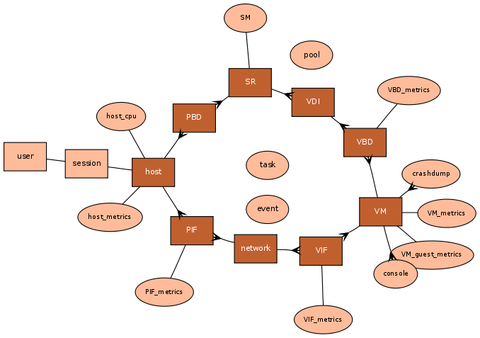

# XCP-ng API

XCP-ng is entirely managed by its API, called "XAPI". XAPI project is hosted [inside the Linux Foundation](https://xenproject.org/developers/teams/xen-api/) and the documentation is available on [its dedicated website](https://xapi-project.github.io/xen-api/).

XAPI is requested by multiple **clients**, like Xen Orchestra or `xe` CLI. See [our management](../../../management) section for more details.

:::tip
We strongly encourage to build applications on top of XO API and not XAPI. In fact, XAPI is made with very specific calls (close to the Xen logic), so it's a lot better to build a solution on top of a more global API, the one [provided by Xen Orchestra](https://xen-orchestra.com/docs/architecture.html#api). It will act as a central point for all your pools and you won't have to handle all the Xen specifics.
:::

## 📐 Architecture

XAPI is using a database (Read/write on the master, replicated to slaves in read only). It's an XML file located at `/var/lib/xcp/state.db`. All the metadata and settings of your pool, hosts, VMs and so on are stored there.



## 🧑‍⚕️ Troubleshooting

### Restarting the API

Sometimes, you might want to restart the toolstack (API and storage stack). You can do it with the following command from the host console (or directly with Xen Orchestra):

 ```
 xe-toolstack-restart
 ```

Restarting XAPI won't affect any running VMs. However, all backup/export tasks will be removed.

### Modifications

:::caution
Those changes aren't officially supported, and will be also wiped after an ISO upgrade.
:::

#### 24h task timeout

Create a new configuration file in `/etc/xapi.conf.d/`. Files in this directory are automatically loaded by XAPI when it starts.

For example, you can name it `/etc/xapi.conf.d/increase-task-timeout.conf`.

Define the new value for `pending_task_timeout`, in seconds.

Example:
```ini
# set XAPI task timeout to 48h
pending_task_timeout = 172800
```


After changing the configuration, restart the toolstack with `xe-toolstack-restart`.

⚠️ Do NOT modify `/etc/xapi.conf` directly: any changes to this file may be overwritten in future XCP-ng updates.
